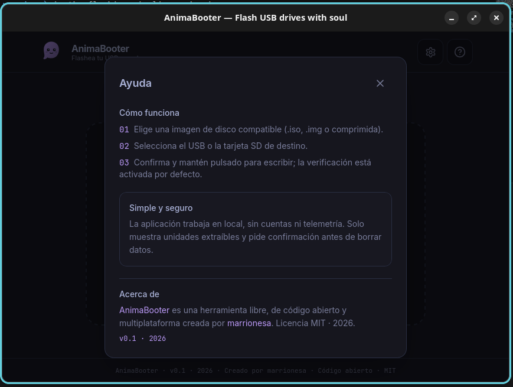
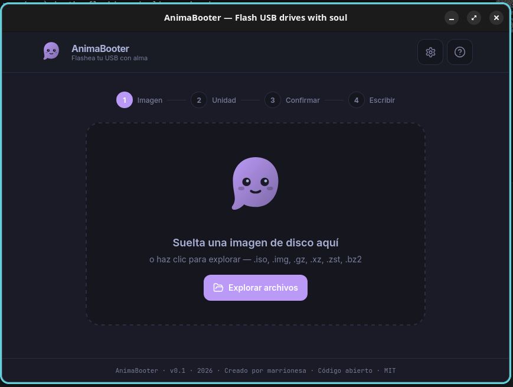

<div align="center">

# AnimaBooter

**Flash USB drives with soul** · *Flashea tu USB con alma*

A tiny, honest, open-source, cross-platform USB image flasher — the small
footprint of usbimager, the UX polish of Etcher, and a technical edge
neither has: a **parallel 3-stage flash pipeline** with **free
verification hashing**.

[](LICENSE)
[](CHANGELOG.md)


[](CONTRIBUTING.md)

**[Features](#why-animabooter) · [Screenshots](#screenshots) · [Install](#install) · [Build from source](#build-from-source-100-local) · [Verificación (ES)](#animabooter-es)**

</div>

---

## Screenshots

<p align="center">
  
  
</p>

<p align="center"><sub>The wizard, step 1 — drop an image on the mascot — and the built-in help dialog. Interface in English and Spanish, three themes.</sub></p>

## Install

Grab a bundle from the [**v0.1.0 release**](https://github.com/marrionesa/animabooter/releases)
— NSIS installer (Windows), `.dmg` (macOS, aarch64), `.deb`/AppImage (Linux).

> ⚠️ **Alpha software** that writes to raw devices — double-check the target
> drive. Binaries are unsigned: SmartScreen / Gatekeeper will warn on first
> run (macOS: right-click → Open).
> See the [verification status](#verification-status) for what is actually
> hardware-tested.

## Why AnimaBooter?

Etcher is sequential: it reads, writes and verifies in a queue, and
verification re-reads, re-decompresses and re-hashes everything.
[AnimaBooter](https://github.com/marrionesa/animabooter) overlaps all of it:

```text
[Reader] ──4 MiB blocks──► [Writer] ──write spans──► [Verifier]
```

1. **Reader** opens the image, detects compression by magic bytes
   (gzip / xz / zstd / bzip2), decompresses in streaming 4 MiB blocks and
   computes **blake3 + sha256 of the decompressed stream while it reads** —
   the source hash is free.
2. **Writer** consumes blocks through a bounded mpsc channel (natural
   backpressure), writes to the device, tracks window + peak speed and emits
   throttled progress (≤ 1 event / 200 ms). Confirmed writes are forwarded
   immediately, so the verifier re-reads *while the rest is still writing*.
3. **Verifier** re-reads the written regions from a dedicated handle and
   compares the read-back hash with the source hash at the end.

Honesty guarantees:

- `sync_all` (flush to physical medium) **always** runs — and must succeed —
  before success is reported.
- The image is **never** fully loaded into RAM.
- When the decompressed size of a compressed image is unknown, the UI shows
  live byte counters instead of a made-up percentage.
- **100% local**: no telemetry, no cloud, no accounts, no network calls at
  runtime. Ever.

### Comparison

| Metric | balenaEtcher | Rufus | usbimager | [AnimaBooter](https://github.com/marrionesa/animabooter) |
| --- | --- | --- | --- | --- |
| Platforms | Win/macOS/Linux | Windows only | Win/macOS/Linux | Win/macOS/Linux |
| Install size | ~300 MB | ~25 MB | ~2 MB | **< 10 MB (target)** |
| Write strategy | sequential | sequential | sequential | **parallel 3-stage pipeline** |
| Verification cost | re-read + re-decompress + re-hash | — | optional | **read-back only — source hash is free** |
| UI | Electron | Win32 | minimal | Svelte 5 wizard + reactive mascot |
| Telemetry | yes | no | no | **NONE — offline by design** |

> Benchmark cells for [AnimaBooter](https://github.com/marrionesa/animabooter) are **targets**, not claims. We publish
> only real, self-measured numbers — measure yourself and fill in your own
> results (`cargo test && pnpm tauri build`, then time a real flash on real
> hardware). Same image, same drive, same port.

### Security as a feature

- Only **removable** drives are listed. Internal disks appear only after
  enabling `unsafe_mode` in `settings.json` — with **two** explicit
  confirmations in the UI.
- Before any device is opened, `flash` re-checks hard, platform rules:
  - Linux: a drive hosting the root filesystem `/` is refused **unconditionally**.
  - Windows: the volume containing `%SystemRoot%` is refused **unconditionally**,
    even in unsafe mode.
  - macOS: internal disks are refused unless unsafe mode is on.
- Every destructive step announces its intent into the live log first.
- The destructive button uses **hold-to-confirm (1.2 s)** — it refuses to
  fire on a misclick. Cancelling a flash warns that the device is left in an
  unknown state and must be re-flashed.

### Verification status

Honesty about what is actually tested is part of this project's ethos:

| Platform | Compiles (CI) | Real flash + boot test |
| --- | --- | --- |
| Linux | ✅ fmt, clippy, tests, build | ✅ **verified by the author on hardware** (real flash, USB boots) |
| Windows | ✅ tests + bundle (MSVC) | ⏳ not yet hardware-tested by the author |
| macOS | ✅ tests + bundle (aarch64) | ⏳ not yet hardware-tested by the author |

Release binaries are **unsigned**: Windows SmartScreen and macOS Gatekeeper
will show a warning on first run (macOS: right-click → Open). Signing and
notarization are planned once distribution becomes serious.

## Build from source (100% local)

### Prerequisites

- **Rust** stable (edition 2021) via your own toolchain manager
- **pnpm** ≥ 9 (or Bun / Node ≥ 18 — the lockfile is `pnpm-lock.yaml`)
- Tauri 2 system dependencies:
  - **Linux**: `libudev` + `libwebkit2gtk-4.1-dev` + `libgtk-3-dev`
    (Debian/Ubuntu: `sudo apt install libwebkit2gtk-4.1-dev build-essential libudev-dev libgtk-3-dev`)
  - **Windows**: Visual Studio Build Tools + WebView2 (preinstalled on Win 11)
  - **macOS**: Xcode Command Line Tools

### Commands

```bash
pnpm install           # install frontend dependencies
pnpm check             # svelte-check, must be clean
pnpm build             # vite production build
cd src-tauri
cargo clippy -- -D warnings
cargo test             # pipeline suites: progress math, throttle 200 ms,
                       # cancellation, 1-byte corruption, gzip roundtrip
cd ..
pnpm tauri build       # bundles for your platform
```

The Windows build additionally needs the icon set (already generated in
`src-tauri/icons/`, including `icon.ico` / `icon.icns`). To regenerate from
new source artwork, run: `pnpm tauri icon <png>`.

### Linux device permissions

Writing to `/dev/sdX` requires privileges. Either run with `sudo`, or install
a udev rule for passwordless flashing (adjust the group to your distro):

```ini
# /etc/udev/rules.d/60-animabooter.rules
# Passwordless write access to removable block devices for plugdev members.
KERNEL=="sd*", ATTRS{removable}=="1", SUBSYSTEM=="block", MODE="0660", GROUP="plugdev"
```

Then: `sudo udevadm control --reload && sudo udevadm trigger`.

## Project structure

```text
index.html, src/          Svelte 5 frontend (TypeScript + Tailwind v4)
  src/components/         Wizard, DriveList, Dropzone, ConfirmModal, ...
  src/lib/                IPC bridge (ipc.ts, types.ts), stores, i18n (EN/ES)
src-tauri/                Rust backend (Tauri 2)
  src/commands/           IPC commands: list_drives, flash, cancel_flash, eject
  src/core/               3-stage pipeline: reader/writer/verifier, progress
  src/image/              image detection + streaming decompression
  src/platform/           per-OS device handling (linux / macos / windows)
  src/safety.rs           hard refusals and device safety rules
  src-tauri/tauri.conf.json, capabilities/
.github/workflows/        ci.yml (manual) and release.yml (manual or v* tags)
```

## Platform notes

- **Windows**: flashing raw devices requires elevation. Without admin rights
  the app offers a one-click **Restart as admin** (PowerShell `runas`, with
  the `--elevated` flag). Writes use `FILE_FLAG_NO_BUFFERING` with
  sector-aligned buffers (sector size from disk geometry, fallback 512), and
  every volume of the target is locked + dismounted first.
- **macOS**: writes go to `/dev/rdiskN` (the raw device, 10–20× faster than
  `/dev/diskN`). If the OS denies raw access, run with `sudo` or grant Full
  Disk Access — a nicer elevation helper is planned for v0.2.
- **Linux**: enumeration uses `udev`; mounted partitions are lazily
  unmounted via `udisksctl` or the flash is rejected with the mount list so
  you can retry.

## IPC contract (summary)

Commands: `list_drives`, `detect_image`, `flash`, `cancel_flash`, `eject`,
`get_settings`, `set_settings`, `restart_as_admin` (Windows).

Events: `flash://phase`, `flash://progress`, `flash://verify`,
`flash://log`, `flash://done`, `flash://error`. All payloads are mirrored
1:1 in `src/lib/types.ts` — keep both sides in sync when touching the
contract.

## Roadmap

- **v0.1 (this release)** — parallel pipeline, free verification hash,
  wizard UI, ResultCard with PNG export, 3 themes, EN/ES, safety holds.
- **v0.2 (planned)** — multi-drive parallel flashing, smart-skip (detect an
  already-flashed drive via a partial hash of its first megabytes), the
  `animactl` CLI.
- **v0.3 (planned)** — distro catalog: pick a distribution, download +
  flash in one click (opt-in, the user stays in control of the network —
  the app itself never phones home).

## Contributing & resources

- [Contributing guide](CONTRIBUTING.md) — rules, validation checklist and
  hardware test protocol.
- [Security policy](SECURITY.md) — supported versions and how to report a
  vulnerability responsibly.
- [Changelog](CHANGELOG.md) — history of public releases.
- CI is intentionally manual for now (`workflow_dispatch`); automatic CI on
  push/PR comes with the public launch.

## License

MIT — see [LICENSE](LICENSE). Open source software made with soul by [marrionesa](https://github.com/marrionesa). Source: [github.com/marrionesa/animabooter](https://github.com/marrionesa/animabooter).

---

# [AnimaBooter](https://github.com/marrionesa/animabooter) (ES)

**Flashea tu USB con alma**

Un flasheador de imágenes USB pequeño, honesto, de código abierto y multiplataforma, creado por [marrionesa](https://github.com/marrionesa). Lo pequeño de usbimager, la UX de Etcher y una ventaja técnica que ninguno tiene: un **pipeline paralelo de 3 etapas** con **hash de verificación gratis**.

- Backend **Rust** (Tauri 2, tokio) · Frontend **Svelte 5 + Tailwind v4**
- Proyecto: [github.com/marrionesa/animabooter](https://github.com/marrionesa/animabooter)
- Creador: [marrionesa](https://github.com/marrionesa)
- Plataformas: **Windows / macOS / Linux** · Licencia **MIT** (c) 2026 [marrionesa](https://github.com/marrionesa)
- Privacidad: **100% local** — sin telemetría, sin nube, sin cuentas, sin llamadas de red en ejecución. Nunca.

## Cómo funciona

```text
[Lector] ──bloques de 4 MiB──► [Escritor] ──rangos escritos──► [Verificador]
```

1. **Lector**: detecta compresión por magic bytes (gzip/xz/zstd/bzip2),
   descomprime en streaming y calcula **blake3 + sha256 del stream
   descomprimido mientras lee** — el hash de fuente es gratis.
2. **Escritor**: recibe bloques por un canal mpsc acotado (backpressure
   natural), escribe en el dispositivo y emite progreso con throttle de
   200 ms. Los rangos confirmados se reenvían al vuelo, así el verificador
   relee **mientras el resto todavía se escribe**.
3. **Verificador**: relee lo escrito desde un handle dedicado y compara el
   hash al final.

Garantías de honestidad: `sync_all` SIEMPRE antes de reportar éxito; la
imagen nunca se carga completa en RAM; si el tamaño descomprimido es
desconocido, la UI muestra contadores reales en vez de un porcentaje falso.

### Seguridad como feature

- Solo se listan discos **extraíbles**; los internos aparecen únicamente con
  `unsafe_mode` activado mediante **dos** confirmaciones.
- Antes de abrir el dispositivo, `flash` re-verifica reglas duras por
  plataforma: Linux rechaza en firme una unidad con `/` montado; Windows
  rechaza en firme el volumen de `%SystemRoot%` (incluso en modo inseguro);
  macOS rechaza discos internos salvo modo inseguro.
- Toda operación destructiva anuncia su intención en el registro en vivo.
- El botón destructivo usa **hold-to-confirm de 1,2 s**. Cancelar avisa de
  que la unidad queda en estado desconocido y debe re-flashearse.

## Instalación

Descarga un bundle de la [**release v0.1.0**](https://github.com/marrionesa/animabooter/releases)
— instalador NSIS (Windows), `.dmg` (macOS, aarch64), `.deb`/AppImage (Linux).

> ⚠️ **Software alpha** que escribe en dispositivos en crudo — revisa dos
> veces la unidad destino. Los binarios van sin firmar: SmartScreen /
> Gatekeeper avisarán en el primer arranque (macOS: clic derecho → Abrir).
> Consulta el [estado de verificación](#estado-de-verificación) para saber
> qué está probado en hardware de verdad.

## Compilar desde fuente

Prerrequisitos: toolchain Rust estable, **pnpm** ≥ 9 (o Bun/Node ≥ 18), y
las dependencias de sistema de Tauri 2 (Linux: `libudev` +
`libwebkit2gtk-4.1-dev`; Windows: VS Build Tools + WebView2; macOS:
Xcode CLT).

```bash
pnpm install && pnpm check && pnpm build
cd src-tauri && cargo clippy -- -D warnings && cargo test
cd .. && pnpm tauri build
```

Permisos en Linux: ejecuta con `sudo` o instala la regla udev de la
sección inglesa (`60-animabooter.rules`, grupo `plugdev`).

## Estructura del proyecto

```text
index.html, src/          Frontend Svelte 5 (TypeScript + Tailwind v4)
  src/components/         Wizard, DriveList, Dropzone, ConfirmModal, ...
  src/lib/                Puente IPC (ipc.ts, types.ts), stores, i18n (EN/ES)
src-tauri/                Backend Rust (Tauri 2)
  src/commands/           Comandos IPC: list_drives, flash, cancel_flash, eject
  src/core/               Pipeline de 3 etapas: lector/escritor/verificador
  src/image/              Detección de imagen y descompresión en streaming
  src/platform/           Manejo de dispositivos por SO (linux/macos/windows)
  src/safety.rs           Reglas duras de seguridad del dispositivo
.github/workflows/        ci.yml (manual) y release.yml (manual o tags v*)
```

## Estado de verificación

La honestidad sobre qué está probado de verdad forma parte de la esencia
de este proyecto:

| Plataforma | Compila (CI) | Flasheo + arranque real |
| --- | --- | --- |
| Linux | ✅ fmt, clippy, tests, build | ✅ **verificado por el autor en hardware** (flasheo real, el USB arranca) |
| Windows | ✅ tests + bundle (MSVC) | ⏳ aún sin prueba de hardware del autor |
| macOS | ✅ tests + bundle (aarch64) | ⏳ aún sin prueba de hardware del autor |

Los binarios de release están **sin firmar**: Windows SmartScreen y macOS
Gatekeeper mostrarán un aviso en el primer arranque (macOS: clic derecho →
Abrir). Firma y notarización están previstas cuando la distribución se
vuelva seria.

## Hoja de ruta

- **v0.1 (actual)** — pipeline paralelo, hash de verificación gratis,
  asistente de 4 pasos, ResultCard con export PNG, 3 temas, EN/ES.
- **v0.2 (previsto)** — multi-drive paralelo, smart-skip (detectar imagen ya
  flasheada vía hash parcial), CLI `animactl`.
- **v0.3 (previsto)** — catálogo de distros descarga+flash (con consentimiento
  explícito del usuario; la app nunca se conecta por su cuenta).

## Contribuir y recursos

- [Guía de contribución](CONTRIBUTING.md) — reglas, checklist de validación
  y protocolo de prueba en hardware.
- [Política de seguridad](SECURITY.md) — versiones soportadas y cómo
  reportar una vulnerabilidad de forma responsable.
- [Changelog](CHANGELOG.md) — historial de releases públicas.

## Licencia

MIT — ver [LICENSE](LICENSE). Software de código abierto hecho con alma por [marrionesa](https://github.com/marrionesa). Código fuente: [github.com/marrionesa/animabooter](https://github.com/marrionesa/animabooter).
